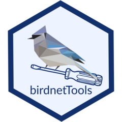
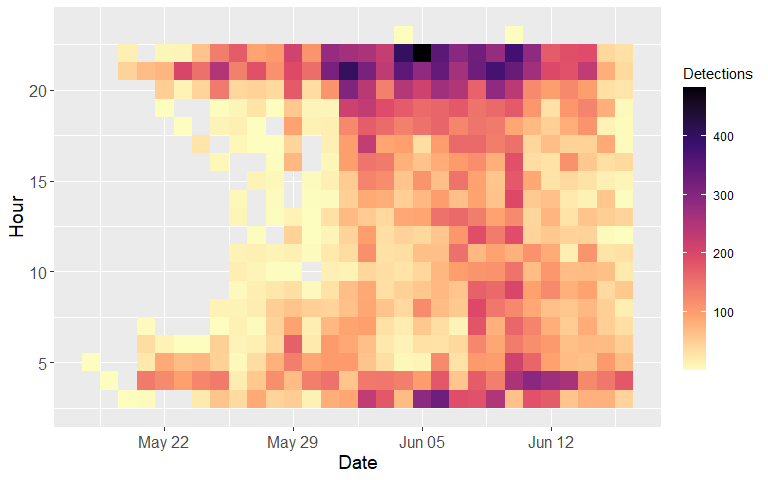

<!-- README.md is generated from README.Rmd. Please edit that file -->

# birdnetTools <a href="https://birdnet-team.github.io/birdnetTools/"></a>

<!-- badges: start -->

[](https://github.com/birdnet-team/birdnetTools/actions/workflows/R-CMD-check.yaml)
[](https://lifecycle.r-lib.org/articles/stages.html#experimental)
[](https://app.codecov.io/gh/birdnet-team/birdnetTools)
<!-- badges: end -->

The `birdnetTools` is an R package designed to streamline the
post-processing and validation of output from BirdNET, an open-source
neural network developed by the [Cornell Lab of
Ornithology](https://www.birds.cornell.edu/home/) and [Chemnitz
University of Technology](https://www.tu-chemnitz.de/index.html.en) for
detecting and identifying bird sounds.

The goal of `birdnetTools` is to help researchers manage, explore, and
validate BirdNET results, which can be derived by [BirdNET
Analyzer](https://github.com/BirdNET-Team/BirdNET-Analyzer), or the
[birdnetR](https://birdnet-team.github.io/birdnetR/index.html) package.
It includes functions for filtering detections by species, confidence,
and date/time; visualizing temporal patterns; and validating detections
with an interactive Shiny app to support threshold-setting workflows.

## Installation

You can install the development version of birdnetTools from
[GitHub](https://github.com/) with:

``` r
# install.packages("pak")
pak::pak("birdnet-team/birdnetTools")
```

## Example use

Below is a quick example using the built-in dataset `example_jprf_2023`,
which contains detections recorded from five ARUs in northern British
Columbia. We’ll filter detections for Swainson’s Thrush, visualize
detection patterns, and calculate a species-specific threshold from
simulated validation data.

``` r
library(birdnetTools)

# Load built-in dataset
data(example_jprf_2023, package = "birdnetTools")
data <- example_jprf_2023

# Filter for Swainson's Thrush detections during spring
data_filtered <- birdnet_filter(data,
  species = "Swainson's Thrush",
  threshold = 0.2,
  year = 2023,
  min_date = "2023-05-01",
  max_date = "2023-06-30"
)

# Visualize daily detection patterns across sites
birdnet_heatmap(data_filtered)
```



``` r


# Simulate validation (for demonstration only)
set.seed(123)
data_sub <- birdnet_subsample(data_filtered, n = 300, method = "stratified")
data_sub$validation <- rbinom(nrow(data_sub), 1, prob = pmin(pmax(data_sub$confidence, 0), 1))

# Calculate species-specific threshold for 90% precision
birdnet_calc_threshold(data_sub, precision = 0.9)
#> ℹ Processing species: Swainson's Thrush
#> ✔ Thresholds calculated to achieve 0.9 precision.
#> # A tibble: 1 × 2
#>   common_name       threshold
#>   <chr>                 <dbl>
#> 1 Swainson's Thrush     0.917
```

## Acknowledgements

The development of `birdnetTools` is part of a visiting scholar program
supported by the [Michael Smith Foreign Study
Supplements](https://www.nserc-crsng.gc.ca/Students-Etudiants/PG-CS/CGSForeignStudy-BESCEtudeEtranger_eng.asp),
funded by the Natural Sciences and Engineering Research Council of
Canada (NSERC). I’m incredibly fortunate to have received this support,
which allowed me to collaborate in person with the BirdNET team in
Chemnitz, Germany.

This has been a valuable opportunity—not only for scientific
collaboration and networking, but also for memorable moments shared with
colleagues and the vibrant atmosphere of life in Europe.

## BirdNET funding and partners

BirdNET is supported by Jake Holshuh (Cornell class of ’69) and The
Arthur Vining Davis Foundations. Our work in the K. Lisa Yang Center for
Conservation Bioacoustics is made possible by the generosity of K. Lisa
Yang to advance innovative conservation technologies to inspire and
inform the conservation of wildlife and habitats.

The development of BirdNET is supported by the German Federal Ministry
of Education and Research through the project “BirdNET+” (FKZ
01\|S22072). The German Federal Ministry for the Environment, Nature
Conservation and Nuclear Safety contributes through the “DeepBirdDetect”
project (FKZ 67KI31040E). In addition, the Deutsche Bundesstiftung
Umwelt supports BirdNET through the project “RangerSound” (project
39263/01).

BirdNET is a joint effort of partners from academia and industry.
Without these partnerships, this project would not have been possible.


