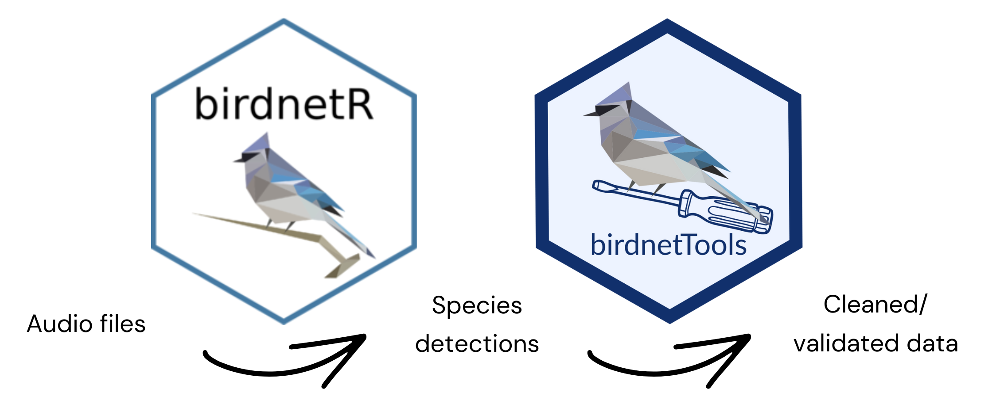
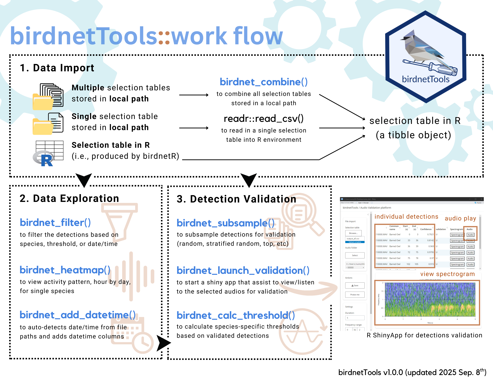

# Summary

`birdnetTools` is an R package for post-processing outputs from BirdNET, an open-source neural network developed by the Cornell Lab of Ornithology and Chemnitz University of Technology for detecting and identifying bird species from audio recordings [@kahl:2021]. The `birdnetTools` package streamlines workflows for cleaning and combining multiple BirdNET selection tables, filtering detections by species, confidence, or date/time, visualizing temporal and spatial patterns, and validating results using an interactive Shiny app. It also supports species-specific and universal confidence thresholds, enabling reproducible threshold-setting workflows.

# Statement of need

Automated acoustic monitoring is increasingly used in ecology and conservation [@perezgranados:2023], with BirdNET being one of the most widely adopted tools for bird sound identification (e.g., @funosas:2024, @mcginn:2023, and @bota:2023). Although BirdNET was developed in Python, most of its primary users are ecologists who conduct analyses primarily in R. This language difference can limit accessibility for some research teams. While the `birdnetR` package [@günther:2025] enables R users to run BirdNET classifications, there is no dedicated framework in R for post-processing these outputs.

The `birdnetTools` R package fills this gap by providing functions built on workflows commonly used in published studies (e.g., @tseng:2024) and by incorporating threshold-setting and validation methods developed in recent research (i.e., @tseng:2025; @wood:2024). By consolidating these tools, `birdnetTools` streamlines analysis and lowers barriers for ecologists and conservation practitioners adopting BirdNET in large-scale monitoring projects (\autoref{fig:packages}).

::: {style="text-align: center;"}
{width="55%"}
:::

# State of the field

Several tools currently exist for processing the raw detection outputs generated by BirdNET. These include the BirdNET Graphical User Interface (GUI), developed by the core BirdNET team to support clip segmentation, validation, and confidence threshold calculation; and the `NSNSDAcoustics` R package, which provides functions and tutorials for gathering results, verifying detections, and generating visualizations such as heatmaps and barcharts. While this tool is effective for its intended use within National Park Service monitoring protocols, `birdnetTools` is designed to be more generic and applicable for independent research projects.

We chose to develop `birdnetTools` as a standalone R package, rather than contributing to existing projects, for three strategic reasons:

1.  **Official Alignment:** By developing this package in close coordination with the core BirdNET team, we ensure that the software’s functionality directly aligns with the underlying algorithm's evolution and the specific requirements of both ecologists and BirdNET developers.

2.  **R Ecosystem Integration:** A significant majority of ecologists rely on the R environment for data management, wrangling, and statistical analysis. `birdnetTools` provides a universal interface in R that functions regardless of the user’s chosen classification environment. Whether researchers utilize the BirdNET-Analyzer Python module [\@kahl:2021], the `birdnetR` package [\@günther:2025], the BirdNET GUI, or specialized software like Raven Pro, `birdnetTools` accepts outputs from these diverse platforms as standardized input for downstream post-processing in R.

3.  **Bridge Between BirdNET Outputs and Ecological Insights:** While existing tools focus primarily on basic data wrangling, `birdnetTools` integrates formal, peer-reviewed BirdNET validation protocols (e.g., \@tseng:2025; \@wood:2024). Furthermore, the package is architected to support future expansions, and serve as a bridge to downstream statistical modeling, such as occupancy modeling via other established R packages, providing a more comprehensive, end-to-end pipeline for acoustic research.

# Software design

The design of `birdnetTools` follows the natural analytical workflow used by ecologists: data import, data exploration, and detection validation. The package architecture is highly integrated, with functions designed to pass information seamlessly from one stage of the pipeline to the next. While the package provides a structured end-to-end framework, its design is also modular; ecologists can incorporate individual functions, such as `birdnet_combine()`, into their existing custom R scripts to integrate BirdNET data into broader analytical pipelines.

In summary, functions in `birdnetTools` fall into three categories: data import, data exploration, and detection validation (\autoref{fig:workflow}).

1.  **Data import**: `birdnet_combine()` integrates BirdNET outputs into R, supporting formats from the BirdNET GUI, Raven Pro, and the `birdnetR` package.

2.  **Data exploration**: `birdnet_filter()` enables filtering by species, threshold, or date/time; `birdnet_add_time()` extracts temporal metadata; and `birdnet_heatmap()` visualizes activity patterns.

3.  **Detection validation**: an R ShinyApp was developed, implementing threshold-setting approaches, including the precision-based method of @tseng:2025 and the probability-based method of @wood:2024.

# Research impact statement

The development of `birdnetTools` was driven by the practical challenges of processing large-scale acoustic datasets during a doctoral research project. Recognizing that many ecologists face hurdles when transitioning from raw machine-learning outputs to ecological modeling, this package was developed in collaboration with members of the core BirdNET team to ensure technical feasibility and analytical accuracy.

By providing a standardized, R-native framework for data cleaning and validation, `birdnetTools` fills a critical gap in the existing bioacoustic software ecosystem. It specifically empowers researchers to implement reproducible validation protocols, a fundamental requirement for high-impact ecological research, while maintaining compatibility with the R-based statistical tools.

# AI usage disclosure

AI tools, specifically ChatGPT (v5.3) and Gemini (v3), were used for the editorial correction of this manuscript and the associated function documentation. All AI-edited content was reviewed and verified by the authors, who take full responsibility for the final text.

# Acknowledgements

The `birdnetTools` project was supported by the Michael Smith Foreign Study Supplements, funded by the Natural Sciences and Engineering Research Council of Canada (NSERC). We thank all members of the BirdNET team for their valuable contributions, and we are grateful to Connor M. Wood and Trey Ursillo for their insightful feedback in improving the package.

The development of BirdNET is supported by the German Federal Ministry of Research, Technology and Space (FKZ 01\|S22072), the German Federal Ministry for the Environment, Climate Action, Nature Conservation and Nuclear Safety (FKZ 67KI31040E), the German Federal Ministry of Economic Affairs and Energy (FKZ 16KN095550), the Deutsche Bundesstiftung Umwelt (project 39263/01) and the European Social Fund.

# References
