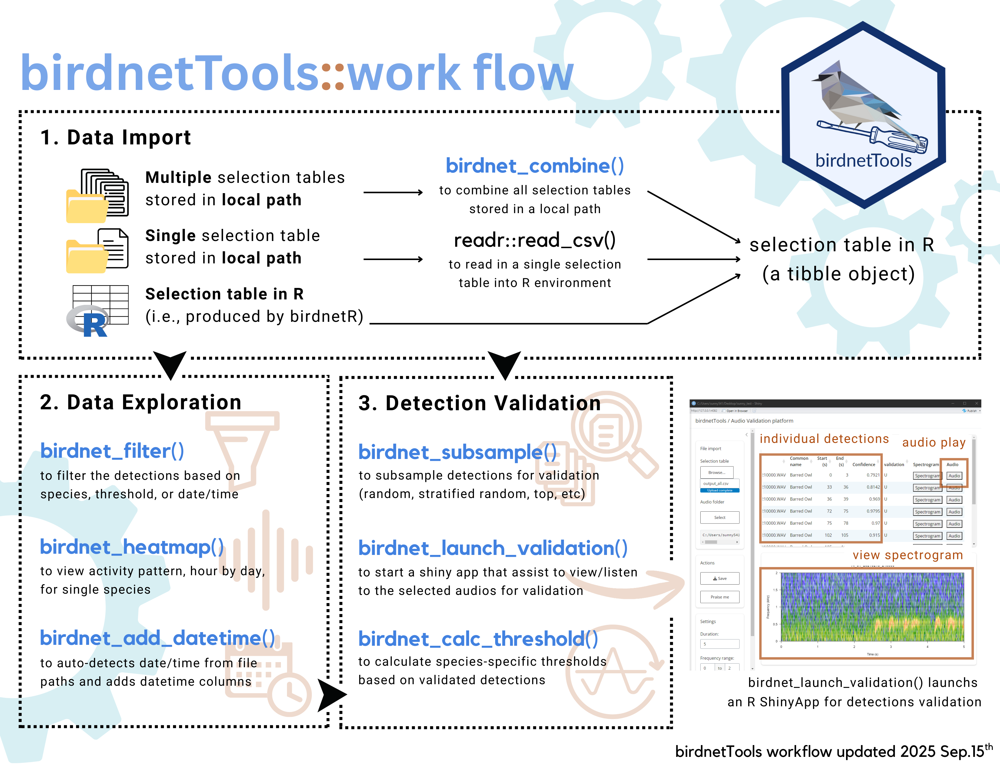

# Summary
`birdnetTools` is an R package for post-processing outputs from BirdNET, an open-source neural network developed by the Cornell Lab of Ornithology and Chemnitz University of Technology for detecting and identifying bird species from audio recordings [@kahl:2021]. The `birdnetTools` package streamlines workflows for cleaning and combining multiple BirdNET selection tables, filtering detections by species, confidence, or date/time, visualizing temporal and spatial patterns, and validating results using an interactive Shiny app. It also supports species-specific and universal confidence thresholds, enabling reproducible threshold-setting workflows. 

# Statement of need
Automated acoustic monitoring is increasingly used in ecology and conservation [@perezgranados:2023], with BirdNET being one of the most widely adopted tools for bird sound identification (e.g., @funosas:2024, @mcginn:2023, and @bota:2023). Although BirdNET was developed in Python, most of its primary users are ecologists who conduct analyses primarily in R. This language difference can limit accessibility for some research teams. While the `birdnetR` package [@günther:2025] enables R users to run BirdNET classifications, there is no dedicated framework in R for post-processing these outputs (\autoref{fig:packages}).

The `birdnetTools` R package fills this gap by providing functions to clean and wrangle BirdNET detections, apply species-specific or universal confidence thresholds, visualize results, and validate predictions through an interactive R Shiny app. Its design is based on workflows commonly used in published studies (e.g., @tseng:2024) and incorporates methods for threshold setting and validation developed in recent research (i.e., @tseng:2025; @wood:2024). By consolidating these tools, birdnetTools streamlines analysis and lowers barriers for ecologists and conservation practitioners adopting BirdNET in large-scale monitoring projects.

{width=60%}

# Key functionalities
Functions in `birdnetTools` fall into three categories: data import, data exploration, and detection validation (\autoref{fig:workflow}).

1. Data import: `birdnet_combine()` integrates BirdNET outputs into R, supporting formats from the BirdNET GUI, Raven Pro, and the `birdnetR` package.

2. Data exploration: `birdnet_filter()` enables filtering by species, threshold, or date/time; `birdnet_add_time()` extracts temporal metadata; and `birdnet_heatmap()` visualizes activity patterns.

3. Detection validation: an R ShinyApp was developed, implementing threshold-setting approaches, including the precision-based method of @tseng:2025 and the probability-based method of @wood:2024.

# Acknowledgements
The `birdnetTools` project was supported by the Michael Smith Foreign Study Supplements, funded by the Natural Sciences and Engineering Research Council of Canada (NSERC). We thank all members of the BirdNET team for their valuable contributions, and we are grateful to Connor M. Wood and Trey Ursillo for their insightful feedback in improving the package.

The development of BirdNET is supported by the German Federal Ministry of Research, Technology and Space (FKZ 01|S22072), the German Federal Ministry for the Environment, Climate Action, Nature Conservation and Nuclear Safety (FKZ 67KI31040E), the German Federal Ministry of Economic Affairs and Energy (FKZ 16KN095550), the Deutsche Bundesstiftung Umwelt (project 39263/01) and the European Social Fund.

# References
