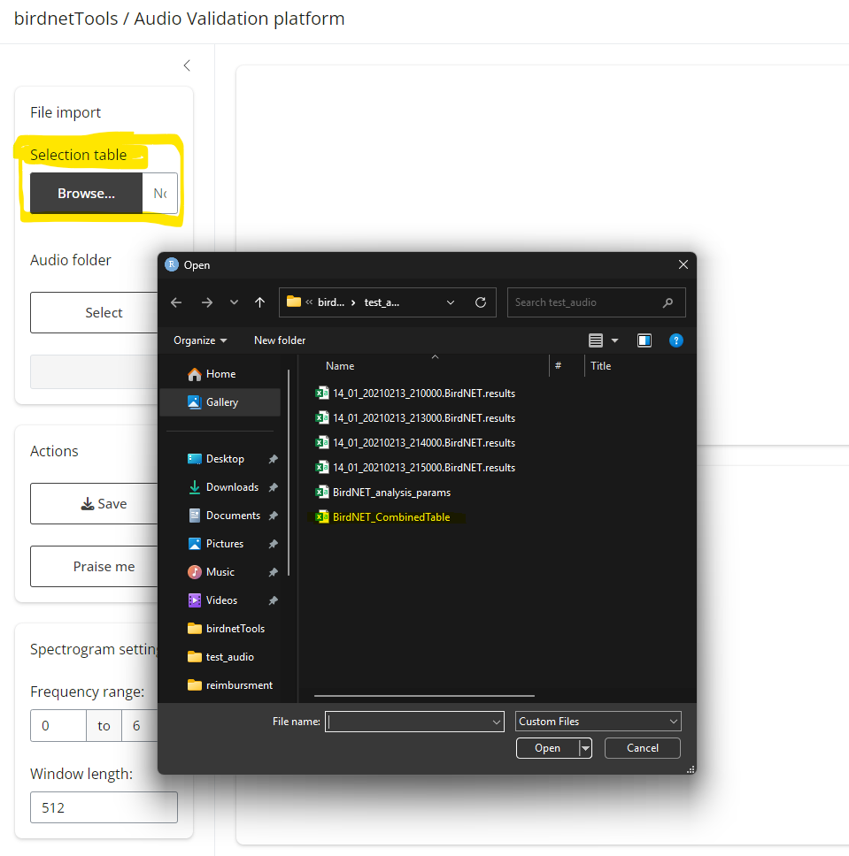
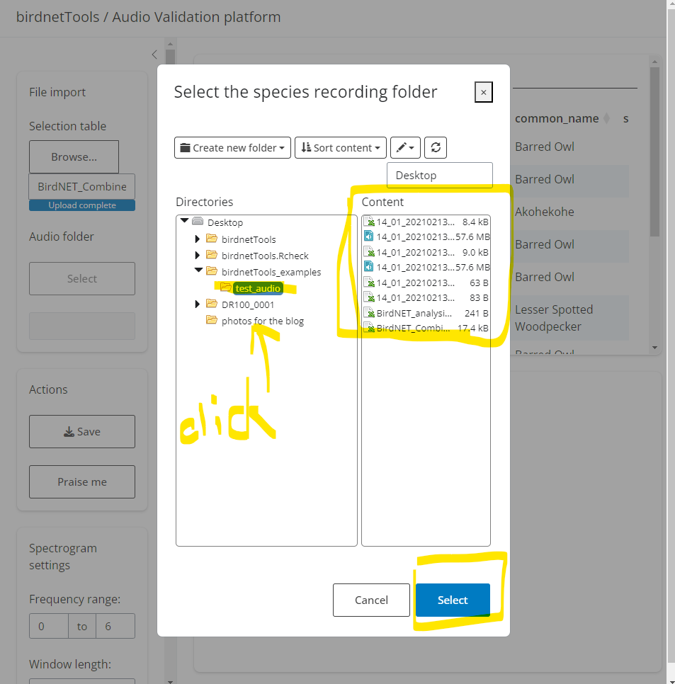
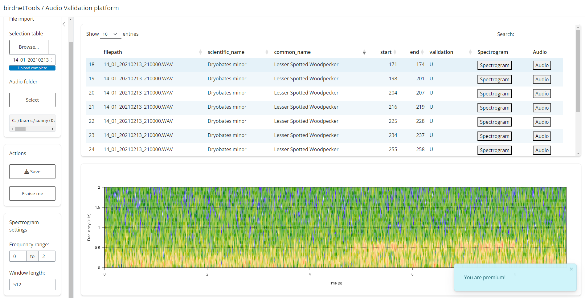

```{r, include = FALSE}
knitr::opts_chunk$set(
  collapse = TRUE,
  comment = "#>"
)
```

```{r setup}
library(birdnetTools)
```


## Background

The `birdnetTools` is an R package designed to streamline the post-processing and validation of output from BirdNET, an open-source neural network developed by the [Cornell Lab of Ornithology](https://www.birds.cornell.edu/home/) and [Chemnitz University of Technology](https://www.tu-chemnitz.de/index.html.en) for detecting and identifying bird sounds. 

The goal of `birdnetTools` is to help researchers manage, explore, and validate BirdNET results, which can be derived by [BirdNET Analyzer](https://github.com/BirdNET-Team/BirdNET-Analyzer), or the [birdnetR](https://birdnet-team.github.io/birdnetR/index.html) package. It includes functions for filtering detections by species, confidence, and date/time; visualizing temporal patterns; and validating detections with an interactive Shiny app to support threshold-setting workflows.

> Make a diagram for the workflow for how users can use this package :) 


## Data Import

BirdNET detections can be imported in various formats depending on how your data was processed and saved. The `birdnetTools` package supports three main workflows: importing multiple detection files from separate audio recordings, importing a single file containing combined results, and using detection results that are already loaded into R.

### Importing multiple detection results

### Importing combined detection results

### Using detection results already in R


## Exploring and Preparing Data


### Example dataset
To demonstrate how the functions in `birdnetTools` work, we will use the built-in dataset `example_jprf_2023`. This dataset contains BirdNET detections recorded at the John Prince Research Forest in British Columbia, Canada, over a continuous 24-hour period during May–June 2023, from 5 ARU locations. The recordings were processed using the BirdNET GUI (model v2.4) with a confidence threshold of 0.1. The dataset contains 392,300 rows and 14 columns, including information such as the file path, start and end times of detections, species names, and confidence scores.


```{r}
# load the dataset
data <- example_jprf_2023

# view the dataset documentation
?example_jprf_2023
```


### Filtering data with customized criteria

In most cases, researchers don’t work directly with the full set of raw BirdNET detections. Instead, they may be interested in filtering for specific specie(s), applying a confidence threshold, narrowing the dataset by date, or selecting recordings from certain hours of the day. The `birdnet_filter()` function makes it easy to apply these filters in a single step:

```{r}
# apply filter
data_filtered <- birdnet_filter(data,
                                species = "Swainson's Thrush",
                                threshold = 0.2,
                                year = 2023,
                                min_date = "2023-05-01",
                                max_date = "2023-06-30",
                                hour = c(0:23)
)

# view function documentation
?birdnet_filter()
```

The `birdnet_filter()` function allows you to filter BirdNET detections based on a variety of criteria, including species, confidence threshold, year, date range, and hour of the day. The `species` argument should be specified using common names, either as a single character string or a vector of names. The `threshold` argument accepts either a numeric value (for a universal threshold) or a data frame containing `common_name` and `threshold` columns (for species-specific thresholds); detections with confidence scores below the specified threshold will be excluded. The `year` and `hour` arguments can also be given as single values or vectors.

After applying filters using `birdnet_filter()`, the function automatically records the filtering criteria in the data's attributes. This makes it easy to keep track of how the dataset was processed:

```{r}
attr(data_filtered, "filter_log")
```


You can also choose to use individual filtering functions. These include filters by species, threshold, year, date range, and hour. The `birdnet_filter()` function serves as a convenient wrapper that combines all of these helper functions.
```{r}
# detection for kinglets
data_kinglet <- birdnet_filter_species(
  data, 
  c("Golden-crowned Kinglet", "Ruby-crowned Kinglet")
  )
```

```{r}
# detection with confidence above 0.85
data_0.85 <- birdnet_filter_threshold(data, 0.85)
```

```{r}
# detection in 2023
data_2023 <- birdnet_filter_year(data, 2023)
```

```{r}
# detection on May 2023
data_may <- birdnet_filter_date_range(data, 
                                      min_date = "2023-05-01", 
                                      max_date = "2023-05-31")
```

```{r}
# detection in the morning (4am to 7am)
data_morning <- birdnet_filter_hour(data, c(4:7))
```


### Visualizing raw/filtered data

Visualization is the easiest way to quickly examine the data, identify any obvious outliers, assess detection distributions, and observe patterns. The `birdnet_heatmap()` function provides this type of visualization and can be used with either raw or filtered data. Below is an example of the activity pattern of Swainson's Thrushe across the breeding season (across 5 ARU sites). 

```{r fig.width=8, fig.align='center', out.width='100%'}
birdnet_heatmap(data_filtered)
```

> Note: If you visualize raw data (before filtering species and site), detections will be grouped across all species and locations — interpret with caution.


### Add columns for date and time

Often, it is necessary to have datetime information associated with the detections to know exactly when the detections were made (i.e., when the bird was singing). The `birdnet_add_datetime()` adds this datetime information to your data. This function requires the original dataset to include datetime details within the file path column. It scans the file path for datetime patterns and extracts the date (year, month, day) and time (hour, minute).

```{r}
# add datetime information to the filtered data
data_with_datetime <- birdnet_add_datetime(data_filtered)

# show which new columns were added
new_columns <- setdiff(colnames(data_with_datetime), colnames(data_filtered))
new_columns
```


## Validating Detections & Getting Thresholds

Each BirdNET detection includes a "confidence" score, but this score does not reflect true probability and varies in meaning across species. For example, BirdNET may detect one species reliably even at low confidence, while another may still yield false positives at high confidence. To improve reliability, it’s recommended to use species-specific thresholds. This section follows the methods outlined in [Tseng et al. 2025](https://link.springer.com/article/10.1007/s10336-025-02260-w), which require a validation process where a subset of detections is reviewed by human experts to classify them as true or false positives. For further context on interpreting confidence scores, see [Wood and Kahl 2024](https://link.springer.com/article/10.1007/s10336-024-02144-5).


### 1. Get a validation set by subsampling

To get the species-specific threshold, we will need to validate detections in `data_filtered`, which contains Swainson’s Thrush detections filtered at a 0.2 confidence threshold. First, we will need to subsample a portion for manual review. The `birdnet_subsample()` function supports three sampling methods: `stratified` (evenly across confidence levels), `random` (selection based on confidence score distribution), and `top` (highest confidence detections). The `stratified` and `random` approaches help create a representative validation set, while `top` sampling targets the most confident predictions.


```{r}
# subsample 300 detections from the filtered data
set.seed(123)  # for reproducibility
data_subsampled <- birdnet_subsample(data_filtered,
                                     n = 300,
                                     method = "stratified")

# view function documentation
?birdnet_subsample()
```


Optionally, you can save the subsampled detections as a `.csv` file in your working directory by setting `save_to_file = TRUE` and specifying a file name:

```{r eval=FALSE}
birdnet_subsample(
  data_filtered,
  n = 300,
  method = "stratified",
  save_to_file = TRUE, # whether to save the subsample to a file
  file = "swainsons_thrush_validation.csv" # name of the file
)
```


### 2. Validation using shinyApp

Manually validating detections, by locating audio files, finding timestamps, and listening to clips, can be slow and tedious. The `birdnet_launch_validation()` function streamlines this process by launching a Shiny app that displays subsampled detections alongside their spectrograms and corresponding audio clips. With an interactive interface, users can quickly review each detection by listening to audio or viewing spectrograms and edit the validation datasheet, making the validation process much more efficient.

```{r eval=FALSE}
birdnet_launch_validation()
```

After running the code above, a Shiny interface will launch. This app requires two inputs:

- Detection file (.csv) – A file containing the BirdNET predictions selected for validation.

- Audio folder path – The directory where your corresponding audio clips are stored.

| Select meta data                     | Select recording folder              |
|--------------------------------------|--------------------------------------|
|  |  |

Once loaded:

- The top panel will display the table of detections. Clicking “Spectrogram” will show the corresponding visual signal below; clicking “Audio” will play the relevant clip.

- To validate, double-click the `U` (Unknown) cell in the `validation` column. Enter `1` for a true positive or `0` for a false positive. Your input will update the original `.csv` file.

- When finished, click “Save” to export your results. A new file will be created with `_validation` appended to the original name. If you only complete part of the validation, this file can later be reloaded to resume the process.

- The “Settings” tab lets you tweak spectrogram display options. And if you're getting tired, try the “Praise me” button for a quick boost of motivation. 🌟





### 3. Get threshold 

Once a set of BirdNET detections has been validated (i.e., manually labeled as true or false positives), you can calculate a species-specific confidence threshold that meets a desired level of precision. The `birdnet_calc_threshold()` function helps identify the minimum confidence score required to achieve a target precision for a given species.


```{r}
# simulate validation as a Bernoulli trial
data_subsampled$validation <- rbinom(
  n = nrow(data_subsampled), 
  size = 1, 
  prob = pmin(pmax(data_subsampled$confidence, 0), 1)
)

```


It only takes one line of code to calculate species-specific thresholds using the `birdnet_calc_threshold()` function. This function requires a data frame containing the columns `common_name`, `confidence`, and `validation` (where validation is `1` for true positives and `0` for false positives). It returns the minimum confidence score needed to achieve the specified precision or probability level. For more details on the difference between the precision and probability arguments, please see the function documentation (`?birdnet_calc_threshold()`).


```{r}
birdnet_calc_threshold(data_subsampled,
                       precision = 0.9)
```


> Note: To demonstrate this function, we use a simulated validation dataset included in the package. This dataset mimics what a real validation file might look like, but it is not derived from actual expert-reviewed audio.

